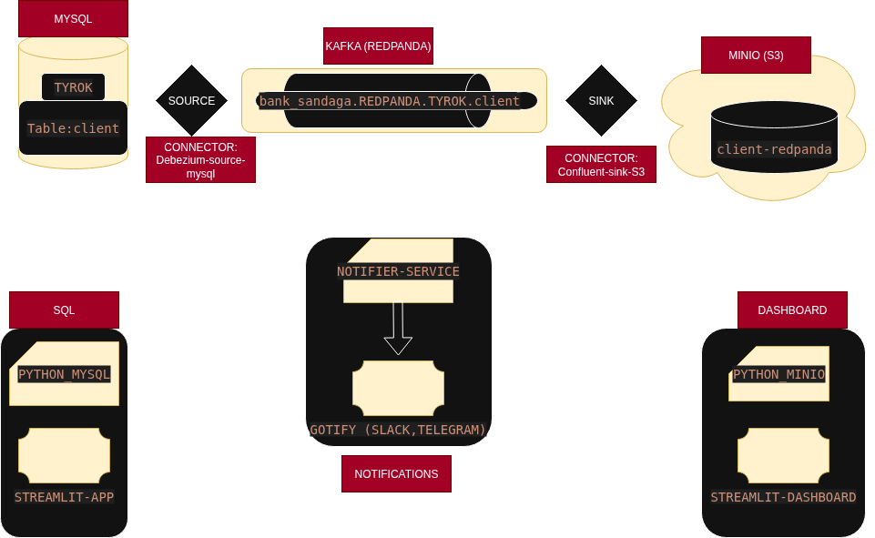
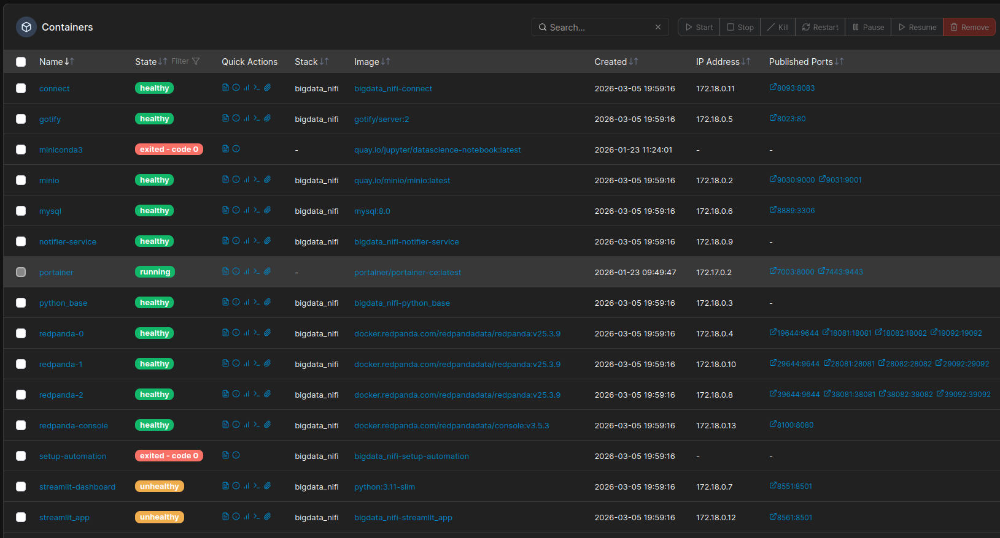
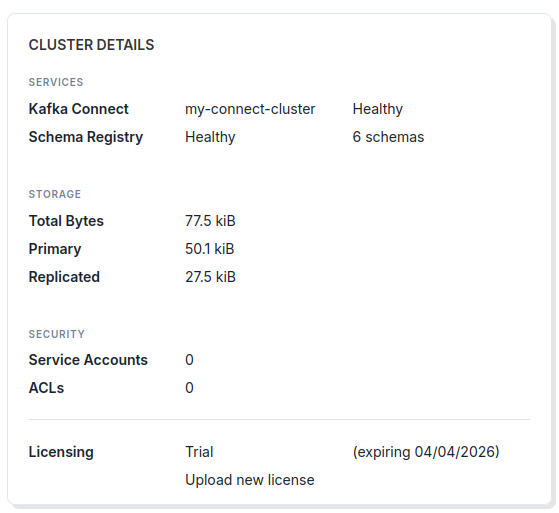
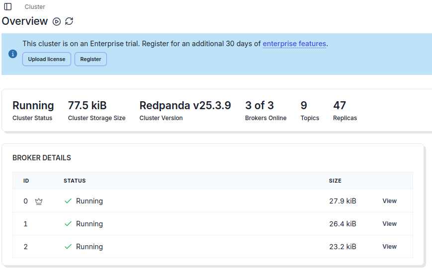
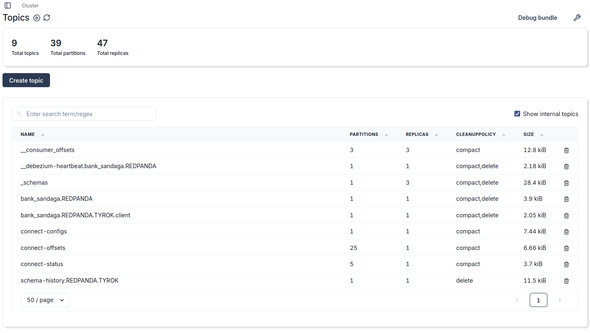
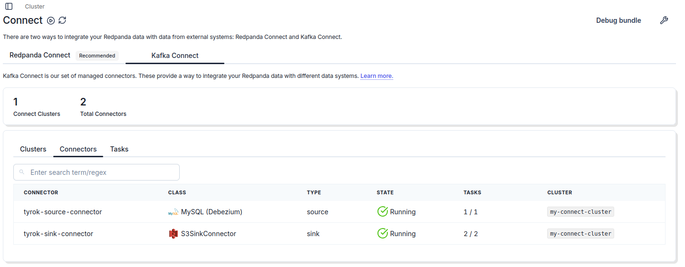
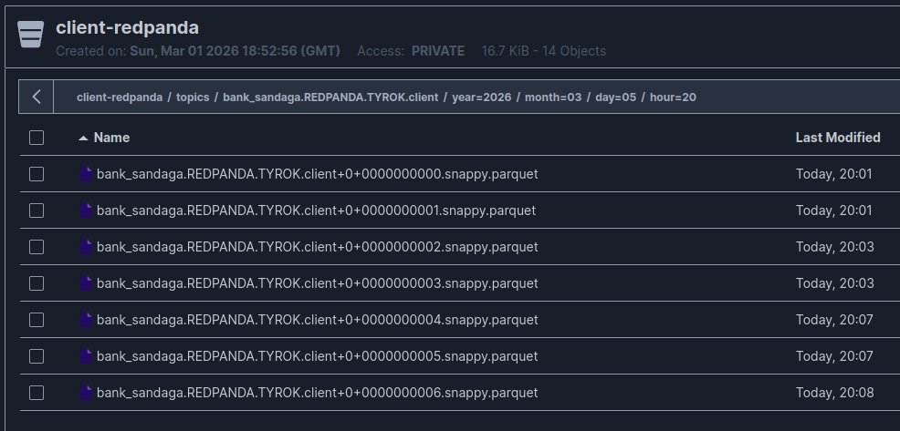
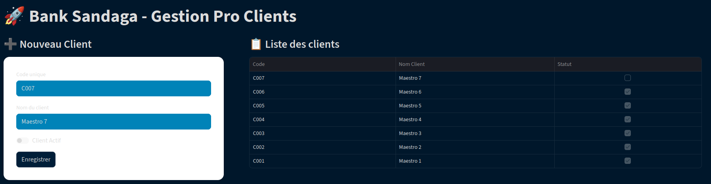
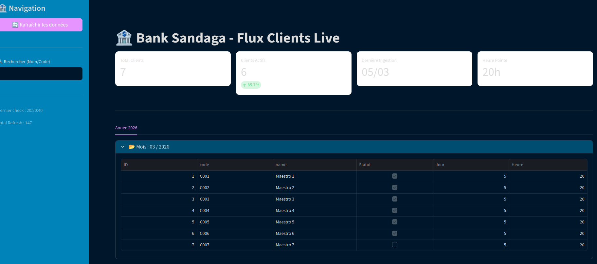
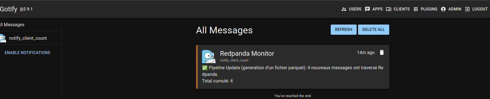

# 🦞 bigdata_nanp - KAFKA (REDPANDA) — BigData streaming stack

Streaming pipeline to ingest datas from `MYSQL` and store them into `.parquet` format in `MINIO bucket` (bucket: `client-redpanda`)

<p align="center">
    <picture>
        <source media="(prefers-color-scheme: light dark)" srcset="images/flow_streaming.drawio.png">
        
    </picture>
</p>

<p align="center">
  <a href="LICENSE"></a>
</p>

---

**Stack** is a simple *BigData streaming stack* running over *Docker*.

It will help you to deploy and test a simple **Streaming** pipeline using **Docker** and **kafka**.

---

**Note: you don't need all this components. the most usefull are `mysql, minio, redpanda-0, connect`.**

## **Components:**

- **mysql:** contains database `TYROK`
- **kafka cluster:** Spread over three nodes (`redpanda-0`, `redpanda-1`, `redpanda-2`). use to ingest tables `client`, `product`, `sales`. `redpanda-0` act as `master node` and the two others as `slave nodes`. **NOTES:** If it's take too much resources, comment or shutdown `redpanda-1` and `redpanda-2`
- **redpanda-console:** UI use to manage kafka (redpanda) cluster `[Topics, Connectors, Consure Groups]`.
- **minio:** store result in `parquet` format. It use bucket `client-redpanda`.
- **connect:** Use to launch `source (mysql, debezium, tyrok-source-connector.json)` and `sink (S3, confluent, tyrok-sink-connector.json) connectors`.
- **notifier-service:** Use to `monitoring` kafka topics and send `alert` to app like `slack or telegram` (in this case `gotify`)
- **gotify:** Notification app client like `slack or telegram`.
- **setup-automation:** Use to `initialize Mysql (User, databases and tables)`, and also `launch connectors source and sink`. You disable it before launching the stack.
- **streamlit_app:** `Client App for Mysql`. You can find `code in folder python/streamlit`.
- **streamlit-dashboard:** `Client App for Minio`. Use to see every datas push inside `Minio bucket client-redpanda` with some `stats`. You can find `code in folder python/streamlit-result`.
- **python_base:** Container used to interact with `Mysql (folder python/python_mysql)` and `Minio (folder python/python_minio)`.

---

## **Files & Folders:**

1- **images:** contains screenshot.
2- **notes:** notes and trash infos.
3- **plugins:** contains 3 files, but only 2 are usefull.

- `confluentinc-kafka-connect-avro-converter-8.1.1.zip`: install inside `connect container`. Provide class to implement `Avro` data manipulation.

- `confluentinc-kafka-connect-s3-10.5.13.zip`: install inside `connect container`. Provide class to implement `Sink to S3`.

- `confluentinc-kafka-connect-avro-converter-7.5.0.zip`: Same as 1-, but an older version.

4- **python:** contains five folders:

- `python_mysql`: scripts use to add and list data in mysql

- `python_minio`: scripts use to add, list, read parquet and bucket in minio

- `notifier`: scripts use to send notification a client like `Telegram, Slack`. In this case we use `GOTIFY`

- `streamlit`: UI to interact with `MYSQL tables`, like an app install on a `client side`. use to populate (simulate) datas

- `streamlit-result`: UI to read datas ingest throw `KAFKA in MINIO`. it's refresh every `15s`.

5- **scripts:** folder For `setup-automation coontainer`, contains 4 files:

- `Dockerfile`: Base on `image alpine:latest`, install libs like `curl, bash and mysql-client`. Workdir `/`, all scripts used to initialize others components reside in this folder inside docker container.

- `init_mysql.sql`: Code SQL to config User `nanp` .

- `setup_tyrok.sql`: Code SQL intialize databases and tables.

- `setup_pipeline.sh`: Shell script use to run `.sql files` and `deploy sink and source connectors`.

6- **config.yml:** config use by `redpanda-console container` to connect to `kafka cluster`. Sample file is **`redpanda-console-config.yaml`**

7- **tyrok-source-connector.json & tyrok-sink-connector.json:** config use to deploy source and sink connectors

---

## **PORTS & configs**

- **Mysql**: Default -> `3306`, Exposed -> `8889`
- **redpanda-console**: Default (http) -> `8080`, Exposed(http) -> `8100`. **`[http://localhost:8100]`**
- **Minio API S3**: Default -> `9000`, Exposed -> `9030`
- **Minio UI**: Default -> `9001`, Exposed -> `9031`. **`[http://localhost:9031]`**
- **connect API Rest**: Default -> `8083`, Exposed -> `8093`
- **gotify UI**: Default -> `80`, Exposed -> `8023`. **`[http://localhost:8023]`**
- **streamlit_app UI**: Default -> `8501`, Exposed -> `8561`. **`[http://localhost:8561]`**
- **streamlit-dashboard UI**: Default -> `8501`, Exposed -> `8551`. **`[http://localhost:8551]`**

---

### **Volumes**
before you start the docker stack, make sure to change volumes locations

```yml

volumes:
  mysql_data:
    driver: local # Define the driver and options under the volume name
    driver_opts:
      type: none
      device: /Change/Path/mysql
      o: bind
  minio_data:
    driver: local # Define the driver and options under the volume name
    driver_opts:
      type: none
      device: /Change/Path/minio
      o: bind  
  gotify_data:
    driver: local # Define the driver and options under the volume name
    driver_opts:
      type: none
      device: /Change/Path/gotify
      o: bind
  redpanda-0:
    driver: local # Define the driver and options under the volume name
    driver_opts:
      type: none
      device: /Change/Path/redpanda/redpanda-0
      o: bind
  redpanda-1:
    driver: local # Define the driver and options under the volume name
    driver_opts:
      type: none
      device: /Change/Path/redpanda/redpanda-1
      o: bind
  redpanda-2:
    driver: local # Define the driver and options under the volume name
    driver_opts:
      type: none
      device: /Change/Path/redpanda/redpanda-2
      o: bind
  share_data:
    driver: local # Define the driver and options under the volume name
    driver_opts:
      type: none
      device: /Change/Path/share_folder
      o: bind

```

---

### **Run project & some cleaning ops**

```sh
# Be sure to be in the folder with compose.yml file
# start all
docker compose up -d

# stop all and clean some volume
docker compose down -v --remove-orphans
```

---

## **Project**

- ### **mysql**
make sur you create all databases and tables or use `setup-automation coontainer`

- ### **minio**
url: **`http://localhost:9031/`**
create bucket `client-redpanda`

- ### **python**
`See main page`, for more infos

#### mysql

```bash
# first, make sure your in python container
docker exec -it python_base bash

# move to '/app/python_mysql'
cd /app/python_mysql

# commands helps
python main.py --help

# test connexion
python main.py test

# list datas
python main.py list client
python main.py list product
python main.py list sales

# add datas
python main.py client --code "C003" --name "Entreprise XYZ"
python main.py product --code "P-TAB" --name "Tablette" --pu 299.99
python main.py sale --client_id 1 --product_id 2 --qte 3 --total 899.97
```

#### minio

```bash
# before, make sure to modify '.env' file

# first, make sure your in python container
docker exec -it python_base bash

# move to '/app/python_minio'
cd /app/python_minio

# commands helps
python main.py --help

# list bucket content
python main.py list --bucket my-bucket

# list all files in a bucket
python main.py list-all --bucket my-bucket

# count files in bucket
python main.py count --bucket my-bucket

# read parquet or csv file
python main.py read --bucket my-bucket --file data.csv --style fancy_grid
python main.py read --bucket my-bucket --file data.parquet --style fancy_grid

# read all parquet or csv file
python main.py read-all --bucket my-bucket --style fancy_grid

# add file in bucket
python main.py put --bucket my-bucket --local /path/to/local/file

```

* ### **Container:** Deployed containers

<p align="center">
    <picture>
        <source media="(prefers-color-scheme: light dark)" srcset="images/portainer_containers.png">
        
    </picture>
  </p>

* ### **Kafka Cluster**

  * **console**: **`https://localhost:8443/nifi/login`** 

  <p align="center">
    <picture>
        <source media="(prefers-color-scheme: light dark)" srcset="images/redpanda_cluster_details.png">
        
    </picture>
  </p>

  * **nodes or borkers:** **`redpanda-0 (master), redpanda-1 & 2 (slaves)`**

  <p align="center">
    <picture>
        <source media="(prefers-color-scheme: light dark)" srcset="images/redpanda_overview.png">
        
    </picture>
  </p>

  * **Resources config:** in .yml file, option `--smp 1` means 1 cores. option `--memory 1G` means 1G RAM allocate. You can tune them.

  * **Client Topic:** `bank_sandaga.REDPANDA.TYROK.client`.

  <p align="center">
    <picture>
        <source media="(prefers-color-scheme: light dark)" srcset="images/redpanda_topics.png">
        
    </picture>
  </p>


* ### **Connect:**

<p align="center">
    <picture>
        <source media="(prefers-color-scheme: light dark)" srcset="images/redpanda_connect.png">
        
    </picture>
</p>

  * **`BOOTSTRAP_SERVERS: redpanda-1:9092,redpanda-2:9092,redpanda-0:9092`**: kafka addresses

  * **`Dockerfile`**: 

    * use base image `debezium/connect:2.7.3.Final`

    ```bash
    FROM debezium/connect:2.7.3.Final

    USER root

    # 1. Installation de unzip pour le connecteur S3
    RUN microdnf install -y unzip
    ```

    * Remove unecessary plugins

    ```bash
    RUN find /kafka/connect -mindepth 1 -maxdepth 1 -type d \
      ! -name "*mysql*" ! -name "*postgres*"  ! -name "*avro*" \
      -exec rm -rf {} +
    ```

    * install **[S3 Plugin](https://d2p6pa21dvn84.cloudfront.net/api/plugins/confluentinc/kafka-connect-s3/versions/10.5.13/confluentinc-kafka-connect-s3-10.5.13.zip)** and Avro plugins


    ```bash
    COPY ./plugins/confluentinc-kafka-connect-s3-10.5.13.zip /tmp/s3.zip
    COPY ./plugins/confluentinc-kafka-connect-avro-converter-8.1.1.zip /tmp/avro.zip

    # 4. EXTRACTION dans le répertoire des plugins de Kafka Connect
    RUN unzip /tmp/s3.zip -d /kafka/connect/ \
        && rm /tmp/s3.zip \
        && chown -R kafka:kafka /kafka/connect/
    RUN unzip /tmp/avro.zip -d /kafka/connect/ \
        && rm /tmp/avro.zip \
        && chown -R kafka:kafka /kafka/connect/

    # 4. Permissions pour l'utilisateur kafka
    RUN chown -R kafka:kafka /kafka/connect/
    USER kafka
    ```

* ### **Minio:** Parquet files

<p align="center">
    <picture>
        <source media="(prefers-color-scheme: light dark)" srcset="images/minio-parquet.png">
        
    </picture>
</p>

* ### **Streamlit, client & Dashboard:** 

<p align="center">
    <picture>
        <source media="(prefers-color-scheme: light dark)" srcset="images/client_ui.png">
        
    </picture>
</p>

<p align="center">
    <picture>
        <source media="(prefers-color-scheme: light dark)" srcset="images/consumer_ui.png">
        
    </picture>
</p>

* ### **Gotify notification:** 

<p align="center">
    <picture>
        <source media="(prefers-color-scheme: light dark)" srcset="images/gotify.png">
        
    </picture>
</p>


Enjoy!


